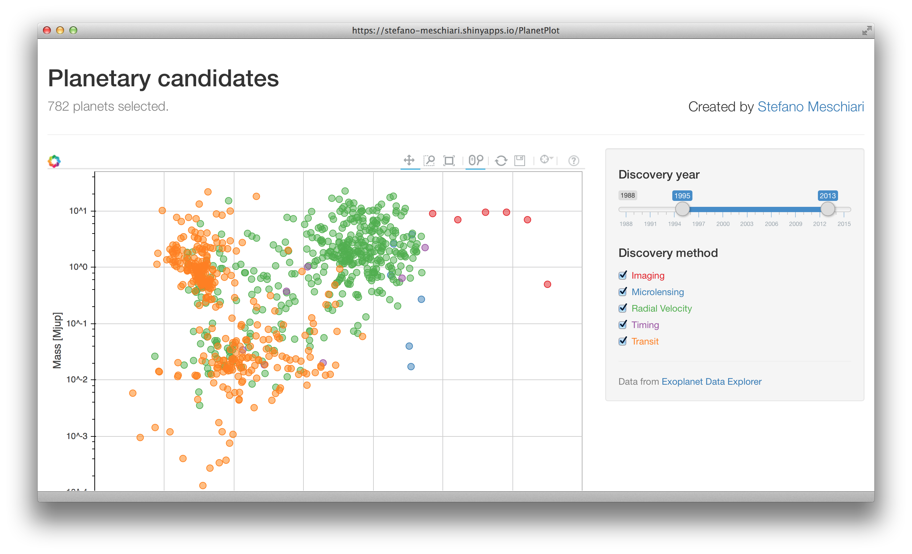

# [Planet Discoveries](https://stefano-meschiari.shinyapps.io/PlanetPlot)
A trivial Shiny app showing an interactive plot of planet candidates discovered up to August 2015. Useful to include in planet discovery papers to supplement the usual introductions boilerplate.

Try changing the "year" slider, and marvel at how few planets we knew before the advent of Kepler.

